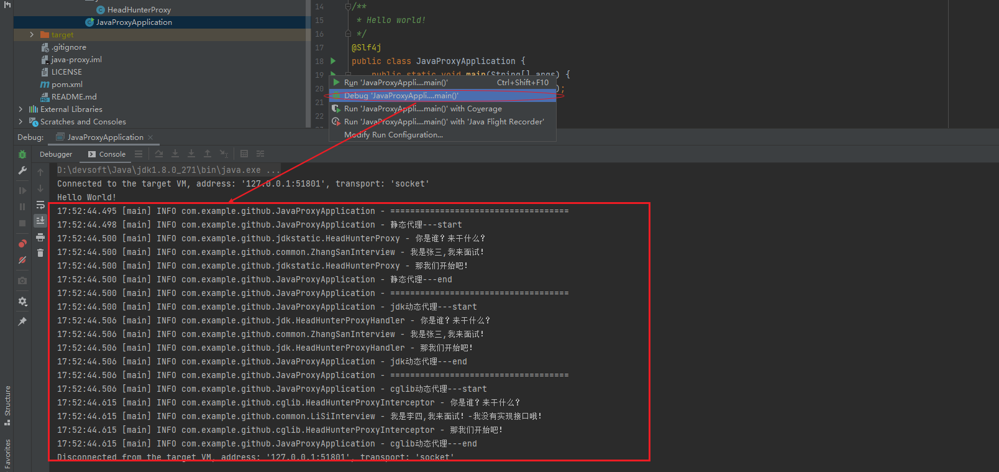

# java-proxy
> java代理模式

[](https://ci.spring.io/teams/spring-framework/pipelines/spring-framework-5.3.x?groups=Build")

## 三种代理模式

### 代理模式
定义：提供了对目标对象另外的访问方式  

好处：可以在目标对象实现的基础上,增强额外的功能操作,扩展目标对象的功能  

关键：代理对象与目标对象。代理对象是对目标对象的扩展,代理对象会调用目标对象

### 静态代理
####实现
代理对象与目标对象要实现相同的接口 或者继承相同的父类。

代理对象要通过调用相同的方法,来调用目标对象的方法。

#### 总结
好处：可以做到不修改目标对象功能的情况下,对目标功能扩展。

不足：会有很多代理类,接口增加方法时,目标对象与代理对象都要维护。


### 动态代理(基于jdk)
####实现
代理对象与目标对象要实现相同的接口 或者继承相同的父类。

代理对象要通过调用相同的方法,来调用目标对象的方法。

#### 总结
好处：可以做到不修改目标对象功能的情况下,对目标功能扩展。

不足：会有很多代理类,接口增加方法时,目标对象与代理对象都要维护。

#### 如何解决静态代理的不足？
使用动态代理。


### 动态代理(基于cglib)
动态代理的特点：代理对象不需要实现接口
#### 实现
jdk动态代理API：Proxy.newProxyInstance()
#### 总结
代理对象不需要实现接口,但目标对象一定要实现接口,否则不能使用jdk动态代理

####实现
需要引入cglib依赖
代理对象实现MethodInterceptor接口,在intercept方法中写逻辑


代理对象要通过调用相同的方法,来调用目标对象的方法。

#### 总结
目标对象不需要实现接口

### 三种代理模式选型
如果加入容器的目标对象有实现接口,使用jdk动态代理
如果........目标对象没有实现接口,使用cglib动态代理

##  使用示例
> 由于java项目一般使用spring boot,我们在maven项目中演示。
### 组件版本
|  组件   | 版本  |
|  ----  | ----  |
| spring boot | 2.3.2.RELEASE |
| cglib  | 3.3.0 |
### 整体目录结构


###  执行后效果


###  代码地址
https://github.com/mqcode/java-proxy.git
## 构建步骤
### 新建maven项目,仅仅引入以下依赖

```xml
<dependencies>
    <dependency>
        <groupId>org.springframework.boot</groupId>
        <artifactId>spring-boot-starter-logging</artifactId>
    </dependency>
    <dependency>
        <groupId>org.projectlombok</groupId>
        <artifactId>lombok</artifactId>
    </dependency>

    <dependency>
        <groupId>cglib</groupId>
        <artifactId>cglib</artifactId>
        <version>3.3.0</version>
    </dependency>
</dependencies>
```


### 公共类
> 注：张三是实现了speak接口,李四没有实现speak接口
```java
/**
 * 接口
 */
public interface Speak {
    void interview();
}
```

```java
/**
 * 被代理类,张三
 */
@Slf4j
public class ZhangSanSpeak implements Speak{
    @Override
    public void interview() {
        log.info("我老婆打我！");
    }
}
```

```java
/**
 * 被代理类,李四
 */
@Slf4j
public class LiSiSpeak {
    public void interview(){
        log.info("我老婆打我！-我没有实现接口哦！");
    }
}
```

### 基于JDK的静态代理
```java
/**
 * 代理类
 */
@Slf4j
public class ZhangSanLawyerSpeak implements Speak {

    private ZhangSanSpeak zhangSanSpeak = new ZhangSanSpeak();

    @Override
    public void interview() {
        log.info("引用法律条文！");
        zhangSanSpeak.interview();
        log.info("打人是不对的！");
    }
}
```
### 基于JDK的动态代理
```java
/**
 * 代理类
 */
@Slf4j
public class LawyerProxy implements InvocationHandler {
    private Object object;

    public LawyerProxy(Object object) {
        this.object = object;
    }

    @Override
    public Object invoke(Object proxy, Method method, Object[] args) throws Throwable {
        if (method.getName().equals("interview")) {
            log.info("引用法律条文！");
            //反射
            method.invoke(object);
            log.info("打人是不对的！");
        }
        return null;
    }
}
```

### 基于cglib的动态代理

```java
/**
 * 代理类
 */
@Slf4j
public class LawyerInterceptor implements MethodInterceptor {
    private Object object;

    public LawyerInterceptor(Object object) {
        this.object = object;
    }
    @Override
    public Object intercept(Object o, Method method, Object[] objects, MethodProxy methodProxy) throws Throwable {
        if (method.getName().equals("interview")) {
            log.info("引用法律条文！");
            //反射
            method.invoke(object);
            log.info("打人是不对的！");
        }
        return null;
    }
}
```

### 测试

```java
package com.example.github;

import com.example.github.cglib.LawyerInterceptor;
import com.example.github.common.Interview;
import com.example.github.common.LiSiSpeak;
import com.example.github.common.Interview;
import com.example.github.common.ZhangSanInterview;
import com.example.github.common.ZhangSanSpeak;
import com.example.github.jdk.LawyerProxy;
import com.example.github.jdkstatic.ZhangSanLawyerInterview;
import com.example.github.jdkstatic.ZhangSanLawyerSpeak;
import lombok.extern.slf4j.Slf4j;
import net.sf.cglib.proxy.Enhancer;

import java.lang.reflect.Proxy;

/**
 * Hello world!
 */
@Slf4j
public class JavaProxyApplication {
    public static void main(String[] args) {
        System.out.println("Hello World!");
        /**
         * 静态代理
         */
        log.info("====================================");
        log.info("静态代理---start");
        Interview interview = new ZhangSanLawyerInterview();
        interview.interview();
        log.info("静态代理---end");
        /**
         * jdk动态代理
         * 特点：本体必须实现接口
         * 缺点：如果某个类没有实现接口,它将无法实现动态代理
         */
        log.info("====================================");
        log.info("jdk动态代理---start");
        LawyerProxy lawyerProxy = new LawyerProxy(new ZhangSanInterview());
        Interview interview1 = (Interview) Proxy.newProxyInstance(JavaProxyApplication.class.getClassLoader(), new Class[]{Interview.class}, lawyerProxy);
        interview1.interview();
        log.info("jdk动态代理---end");
        /**
         * cglib动态代理
         * 特点：是JDK动态代理的补充,本体不需要实现接口
         */
        log.info("====================================");
        log.info("cglib动态代理---start");
        LawyerInterceptor interceptor = new LawyerInterceptor(new LiSiSpeak());
        LiSiSpeak liSi = (LiSiSpeak) Enhancer.create(LiSiSpeak.class, interceptor);
        liSi.interview();
        log.info("cglib动态代理---end");

    }
}
```